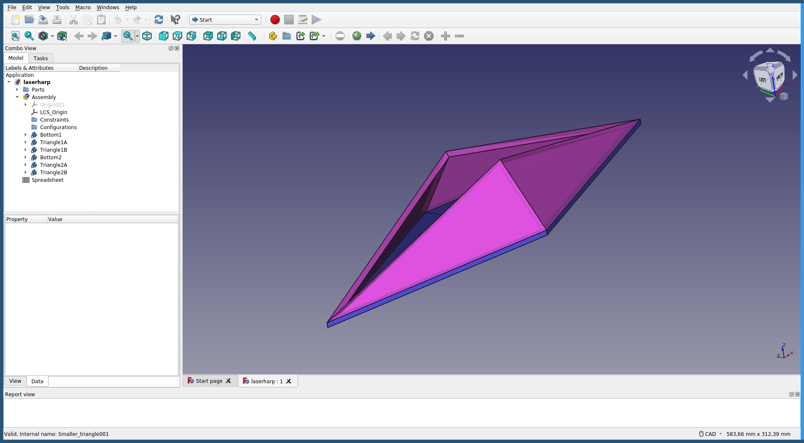
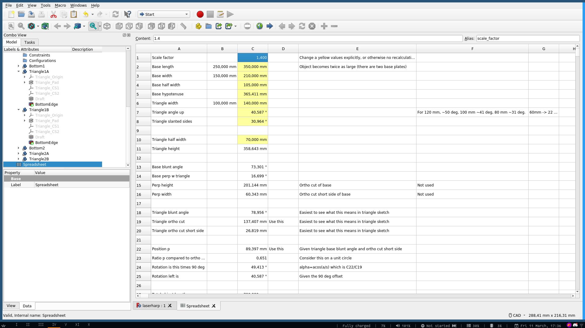
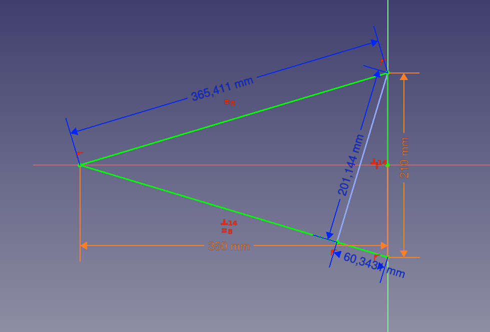
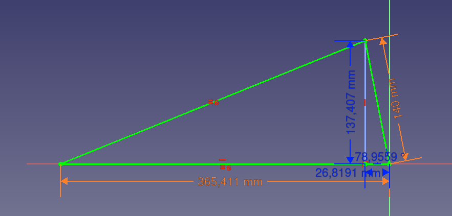

# Laserharp

A 3D model of a laserharp as can be found on [instructables](https://www.instructables.com/Frameless-Laser-Harp/). I wanted to create a laserharp as well and found the shape of this thing quite interesting. However, the 3D model was not available (or I couldn't find it). So, I decided to create it myself.

* This is my first time using Freecad (0.19) or any CAD program. Forgive me if I'm doing things wrong or peculiar!
* There are two parts created. A "base" part of which two of them form the bottom part of the object. A "triangle" part of which four of them are tilted in a certain way so you get this nice opening in the middle.
* The Assembly 4 Workbench addon to create the entire thing from its parts.
* The Spreadsheet function has been used to be able to change the shape a little bit. For example, when making the tilted triangles larger they have to tilt differently to still fit tight.

# Calculations

The calculations to come up with perfectly fitting triangles are actually not so easy to figure out at once (at least for me).

How I did this was by envisioning the tilted triangle to be flat alongside one of the sides of the base. Now, you have to realize it is rotating along that side (not perpendicular to the length axis of the entire object).

It's somehow hard to explain. Maybe I'll come back one day with some pictures.

# Image

# Spreadsheet

Currently the following dimensions have been used (see screenshot).

The baseplate is two triangles of length 350 mm and width 210 mm back-to-back forming a rhombus. Or seen otherwise, as four right triangles with a length of 350mm and a width of 105 mm. The rhombus has then a length of 700 mm and a width of 210 mm.

The triangles that are tilted upwards are of length 358.643 mm and width 140 mm. Or seen otherwise, as two right triangles with a length of 358.643 mm and a width of 70 mm.

# Copyrights

There are no additional copyrights on the model that I have created, but the copyright as stated on <https://www.instructables.com/Frameless-Laser-Harp/> is Attribution-NonCommercial-ShareAlike 4.0 International (CC BY-NC-SA 4.0), see [here](https://creativecommons.org/licenses/by-nc-sa/4.0/). If you worry about the use, please contact [Pushan Panda](https://www.instructables.com/member/Pushan+Panda/), for example at [his website](https://www.pushanpanda.me/).
